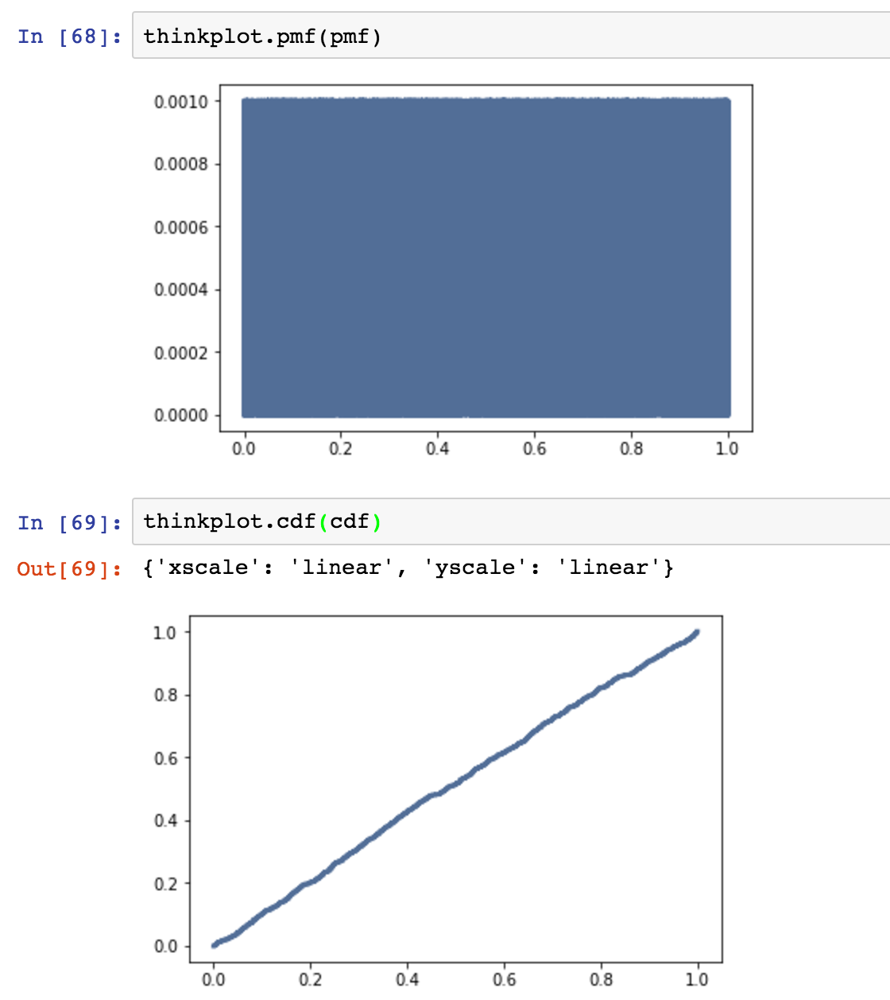

[Think Stats Chapter 4 Exercise 2](http://greenteapress.com/thinkstats2/html/thinkstats2005.html#toc41) (a random distribution)
```python
import random

random_list = []
for i in range(1000):
    random_list.append(random.random())
pmf = thinkstats2.Pmf(random_list)
cdf = thinkstats2.Cdf(random_list)

thinkplot.pmf(pmf)
thinkplot.cdf(cdf)
```


